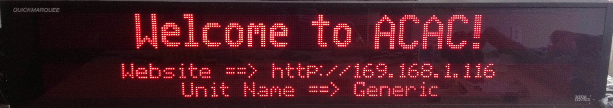
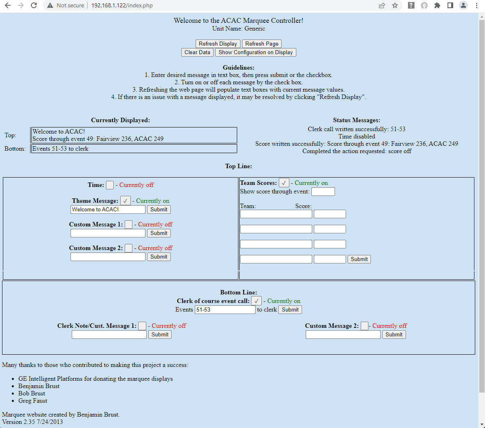

# ACAC Marquee
Project to display swim meet and other facility information on LED Marquee signs donated by General Electric. 

This code is run from a Raspberry Pi inside the sign which is connected by ethernet to a local network. A computer on the local network can open the webage of the sign (IP address) to set text to display from the sign.

At startup, the Raspberry Pi will command the display to show the IP address.

This code consists of two main portions, python and web.
- The Python script was written with Python 2.7, so may need some updating to support 3+.
- The website consists mainly of php and JavaScript. The JavaScript code was not developed as part of this project, instead it was used in its entirety from a different source.

In order to communicate with a marquee sign, the Raspberry Pi uses a USB->serial adapter (even though a GPIO pin on the Raspberry Pi could have been used directly).

To make the system seamless, the python script needs to be started automatically when the device starts up.

## Setup steps for the signs as provided:
- Plug the signs into power
- Power on a nearby router
- Connect the sign ethernet cords to the router
- Connect a computer to the router's network
- Browse to the website displayed on the sign

---

## To Make It Work
For more details, see [large_marquee-swim.py](python/large_marquee-swim.py)

The web page functionality can be enabled by installing apache2.
This is done by running "sudo apt-get update" followed by "sudo apt-get install apache2" in the terminal.

A USB -> serial port is required for operation. While our tests have always used the top USB port of the Pi, it may not matter which port.
This serial port must be connected to the marquee's RS232 recieve and ground ports.
The USB-> serial converter used in the past has had a DB9 connector, which sends from pin 3, and ground is pin 5.

1. Copy all files from the `web` folder to `/var/www/`
   - `sudo cp ./web/*.* /var/www/`
2. Configure apache2 to use `/var/www/` as root directory and enable php.
2. Run python script
   - `sudo python large_marquee-swim.py`

For more details, see [large_marquee-swim.py](python/large_marquee-swim.py)

Recommendations:
- Turn off ssh for security reasons
- This is designed to work through a dedicated secured router, which is the only security put in place to prevent unauthorized from abusing the powers
- To make this system run automatically on startup:
   - Make sure apache is installed (web server)
   - Add `sudo python [directory]/large_marquee-swim.py &` to `/etc/rc.local` just above exit 0.
      - The directory is where the python file is saved.
      - The & is to continue with boot tasks after starting.
